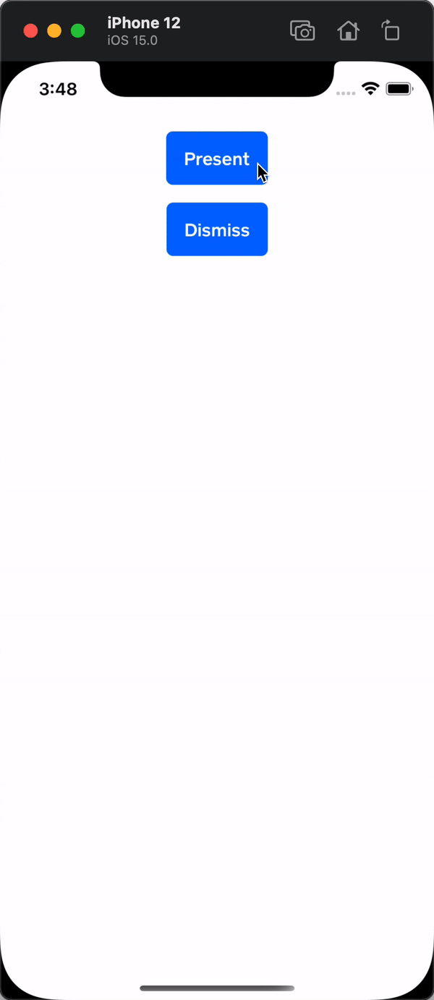

# Vanilla UIKit Usage

## 1. Install a modal host

_**Note**: If you're using `WorkflowModals` and set up a `ModalHostContainer` at the root of your app, you do not need to set up a `ModalHostContainerViewController`, since `ModalHostContainer` wraps `ModalHostContainerViewController`. Similarly, if your app uses both UIKit and Workflows and you set up a `ModalHostContainerViewController`, you do not need to install a `ModalHostContainer`._

`Modals` uses a container view controller to host presented modals. In order to present modals within your application, you must install a `ModalHostContainerViewController` at the root of your view controller hierarchy. For example, in your scene delegate you could wrap your root view controller in a host:

```swift
func scene(
    _ scene: UIScene, 
    willConnectTo session: UISceneSession, 
    options connectionOptions: UIScene.ConnectionOptions
) {
    guard let windowScene = scene as? UIWindowScene else { return }
	
    let window = UIWindow(windowScene: windowScene)
    let myRootViewController = MyRootViewController()

    // Set up the modal host
    window.rootViewController = ModalHostContainerViewController(content: myRootViewController)

    self.window = window
    window.makeKeyAndVisible()
}
```

## 2. Define a modal presentation style

Modal presentation styles describe how to lay out and decorate a presented modal. To define a presentation style, define a struct that conforms to `ModalPresentationStyle` and implement the following required methods:

- `displayValues(for context:)` describes how the modal is displayed once its presented.
- `enterTransitionValues(for context:)` during presentation, the system will animate from these values to the display values.
- `exitTransitionValues(for context:)` during dismissal, the system will animate from the display values to these values.

Let's create a "card" style with rounded corners that's centered in the screen with some insets. We want our card to animate in from the center of the screen with a transform, and opacity transition, and exit in the same fashion:

```swift
struct CardModalStyle: ModalPresentationStyle {
    func displayValues(for context: ModalPresentationContext) -> ModalDisplayValues {
        return ModalDisplayValues(
            frame: frame(for: context),
            roundedCorners: roundedCorners(),
            overlayOpacity: 0.6
        )
    }

    func enterTransitionValues(for context: ModalPresentationContext) -> ModalTransitionValues {
        return ModalTransitionValues(
            frame: frame(for: context),
            alpha: 0,
            transform: CGAffineTransform(scaleX: 0.8, y: 0.8),
            roundedCorners: roundedCorners()
        )
    }

    func exitTransitionValues(for context: ModalPresentationContext) -> ModalTransitionValues {
        // Our exit values are the same as the entrance values
        enterTransitionValues(for: context)
    }

    // Since our corners are the same for entrance, exit and display, we'll use this helper function
    private func roundedCorners() -> ModalRoundedCorners {
        ModalRoundedCorners(radius: 12, corners: .all)
    }
    
    // Since the frame for entrance, exit and display is the same, we'll create a helper function
    // for calculating the frame
    private func frame(for context: ModalPresentationContext) -> CGRect {
        // Ensure we respect the safe area
        let availableSize = context.containerCoordinateSpace.bounds
            .inset(by: context.containerSafeAreaInsets)

        // Inset our width by 20pts, with a maximum of 400pts
        let width = min(availableSize.width - 20, 400)

        // If our presented view has a preferred content size, use that for the height,
        // otherwise default to 240pts
        let height: CGFloat

        switch context.preferredContentSize {
        case .known(let size):
            height = min(size.height, availableSize.height)
        case .unknown:
            height = 240
        }

        // Center the modal within the safe area
        let origin = CGPoint(
            x: (availableSize.width - width) / 2 + context.containerSafeAreaInsets.left,
            y: (availableSize.height - height) / 2 + context.containerSafeAreaInsets.top
        )

        return CGRect(origin: origin, size: CGSize(width: width, height: height))
    }
}
```

## 3. Present a view controller

Now that we have a host and a modal style, we can present a modal from our view controller. When you import `Modals`, you'll have access to a `modalPresenter` object on `UIViewController`. This object allows you to present modals, and returns a lifetime token that allows you to dismiss the modal. Retain this token as long as you want the modal to be presented. For example:

```swift
class MyViewController: UIViewController {
    
    private var presentedModalLifetime: ModalLifetime?
    
    @IBAction presentModal() {
        let viewController = MyViewController()
       	
        viewController.onTapDismiss = { [weak self] in
			// Dismiss the presented modal when dismiss is tapped
            self?.presentedModalLifetime = nil
        }
        
        // Retain the modal lifetime token
        presentedModalLifetime = modalPresenter.present(
            viewController, 
            style: .init(CardModalStyle())
        )
    }
}
```


